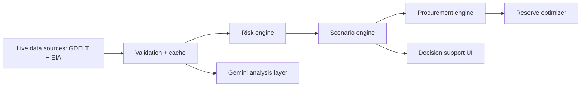

# ShieldChain AI

ShieldChain AI is a competition-ready decision-support prototype for India’s crude-oil supply-chain resilience, built by HackShield for OOSC 4.0 Hackathon, IIIT Allahabad. It connects live signals, an India-level exposure model, disruption scenarios, indicative rerouting options, and a strategic petroleum reserve (SPR) model without presenting assumptions as official forecasts.

## Problem

India imports most of its crude oil and is exposed to disruption in key maritime corridors. During a disruption, decision-makers need a transparent way to distinguish observed signals from model assumptions and turn them into a tested response path.

## Solution

The product follows one connected decision chain: live signals → corridor risk → India exposure → scenario supply gap → illustrative economic impact → procurement options → SPR response → recommended action.

## Key Features

- Live-source status, freshness, provenance, and manual refresh
- GDELT event-signal risk normalization with LIVE / STALE / UNAVAILABLE handling
- EIA WTI market context when an EIA key is configured
- Server-only Gemini analysis with deterministic fallback
- India-level Hormuz exposure model and combined-route cap
- Scenario comparison, sensitivity sliders, procurement explainability, and SPR drawdown chart

## Architecture



## Data Sources

- **GDELT DOC 2.0:** public geopolitical and shipping-related event signals. Cached for one hour.
- **U.S. EIA API v2:** latest available WTI petroleum observation. Cached for five minutes.
- **Seeded public-data inputs:** Indian import dependence, reserve cover, exposure shares, and indicative routing capacities.

The dashboard labels each source as `LIVE`, `STALE`, `UNAVAILABLE`, `ERROR`, or `FALLBACK` where applicable. Cached results are never represented as fresh live data.

## AI Layer

Gemini is used only server-side to analyze structured backend evidence. It is an analysis layer, not a source of physical-world facts. Available Gemini models are discovered against the configured API key at runtime. If Gemini is unavailable, a deterministic recommendation fallback is used and labeled accordingly.

## Scenario Engine

Hormuz exposure is calculated from India’s imported-crude requirement and seeded 45% pre-crisis Hormuz share—not global Hormuz transit volume. Other route proxies are capped within India’s import basket, and the Hormuz + Red Sea scenario avoids double-counting. Outputs are **decision-support estimates**.

## Procurement Engine

Recommendations rank indicative source/routing options by spare capacity, cost premium, transit time, and available risk signals. Routing/capacity values are illustrative decision-support estimates, not cargo offers.

## Reserve Optimizer

The SPR page models drawdown share, gap remaining, and estimated exhaustion using the scenario gap. It is an **illustrative model**, never a statement of official reserve levels.

## Data Reliability / Fallbacks

- Provider calls have timeout, validation, and independent caching boundaries.
- A failed refresh with cache returns `STALE` data and its successful timestamp.
- A failed refresh without cache returns `UNAVAILABLE`; it never creates a zero-risk value.
- `/api/live` always returns HTTP 200 with a normalized usable payload, even if providers fail.

## Technology Stack

Next.js 14 App Router, TypeScript, Tailwind CSS, React Leaflet, Recharts, `@google/genai`, GDELT DOC API, and EIA API v2.

## Local Setup

```bash
npm install
cp .env.example .env.local
npm run dev
```

Open `http://localhost:3000`.

## Environment Variables

```env
EIA_API_KEY=
GEMINI_API_KEY=
GDELT_ENABLED=true
```

`EIA_API_KEY` and `GEMINI_API_KEY` are server-only. Never use a `NEXT_PUBLIC_` prefix and never commit `.env.local`.

## API Endpoints

- `GET /api/live` — normalized source state, market context, risk signals, events, and Gemini analysis
- `GET /api/live?refresh=1` — attempts a provider refresh while preserving stale fallback behavior
- `POST /api/scenario` — deterministic India-level scenario calculation
- `POST /api/procurement` — indicative procurement ranking and analysis/fallback
- `GET /api/reserve?gapMbd=` — illustrative SPR depletion curve
- `GET /api/risk-score` — normalized corridor risk compatibility endpoint

## Screenshots

Run the application locally and capture the Dashboard, Scenario, Procurement, and Reserve pages. The live status panel intentionally shows real provider freshness rather than mocked screenshots.

## Demo Flow

1. Open Dashboard and point out data provenance and corridor-risk confidence.
2. Click **Replay disruption**.
3. Inspect the India-level exposure, impact, sensitivity analysis, and decision chain.
4. Click **Send to procurement orchestrator**.
5. Explain the ranked basket and **Why this recommendation?** panel.
6. Open Reserve and evaluate SPR contribution and remaining gap.

## Model Assumptions

India import exposure, SPR cover, and corridor baseline are public-data inputs. Price elasticity, freight premium, GDP sensitivity, and routing capacity are illustrative assumptions. All calculated impacts are model outputs. They are not official forecasts, cargo offers, or policy guidance.

## Limitations

GDELT is a news/event signal rather than a verified shipping-position feed. EIA WTI is market context, not India delivered crude pricing. The economic multipliers and routing capacities are transparent proxies. Free-tier provider availability can vary.

## Future Roadmap

Add verified freight and vessel-position feeds, refinery crude-slate constraints, real cargo availability integrations, calibrated econometrics, multi-country exposure, and durable distributed caching.

## Contributing

Open an issue or submit a focused pull request. Preserve the source-status semantics and never add secrets or fabricated live data.

## License

Add the team’s preferred open-source license before public release.
