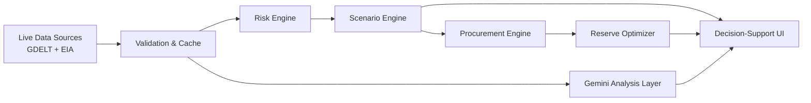

<div align="center">

# ShieldChain AI

**AI-driven energy supply chain resilience for import-dependent economies**

[](https://nextjs.org/)
[](https://www.typescriptlang.org/)
[](https://tailwindcss.com/)
[](https://react.dev/)
[](https://leafletjs.com/)
[](https://blog.gdeltproject.org/gdelt-doc-2-0-api-debuts/)
[](https://www.eia.gov/opendata/)
[](https://ai.google.dev/)

</div>

---

ShieldChain AI is an AI-assisted decision-support platform designed to help analyze disruption risk across critical energy supply corridors and translate observed signals into transparent, scenario-based response options.

> **Note:** ShieldChain AI is a decision-support prototype. It clearly distinguishes **observed/live signals**, **model assumptions**, **illustrative estimates**, **AI analysis**, and **decision-support outputs**. It does not provide official forecasts, autonomous decisions, or policy guidance.

---

## Table of Contents

- [Overview](#overview)
- [The Problem](#the-problem)
- [Solution](#solution)
- [Key Capabilities](#key-capabilities)
- [System Architecture](#system-architecture)
- [Data Sources & Provenance](#data-sources--provenance)
- [AI Layer](#ai-layer)
- [Risk Engine](#risk-engine)
- [Scenario Engine](#scenario-engine)
- [Procurement Engine](#procurement-engine)
- [Reserve Optimizer](#reserve-optimizer)
- [Decision Chain](#decision-chain)
- [Demo Flow](#demo-flow)
- [Technology Stack](#technology-stack)
- [Local Development](#local-development)
- [Environment Variables](#environment-variables)
- [API Reference](#api-reference)
- [Reliability & Data Handling](#reliability--data-handling)
- [Screenshots](#screenshots)
- [Model Assumptions](#model-assumptions)
- [Limitations](#limitations)
- [Future Roadmap](#future-roadmap)
- [Team](#team)
- [Contributing](#contributing)
- [License](#license)

---

## Overview

India imports the majority of its crude oil and faces significant exposure to disruptions across critical maritime corridors — particularly the Strait of Hormuz and the Red Sea. When a disruption occurs, decision-makers need to rapidly assess corridor risk, understand India-level exposure, model supply gaps, evaluate procurement alternatives, and plan strategic reserve responses.

**ShieldChain AI** addresses this by providing a connected, end-to-end decision-support workflow that converts live signals into structured, transparent analysis — from initial event detection to recommended action.

---

## The Problem

India's crude oil import dependency creates a structural vulnerability to disruptions in key maritime chokepoints. During a disruption event, decision-makers must rapidly traverse a complex analytical chain:

```
Observed Signal → Corridor Risk → India Exposure → Supply Gap →
Economic Impact → Procurement Options → Reserve Response → Recommended Action
```

Each step requires distinguishing **what is observed** from **what is modeled**, and presenting both transparently. Existing approaches often conflate live data with assumptions, making it difficult to evaluate confidence in any given recommendation.

---

## Solution

ShieldChain AI implements a connected decision-support workflow where each analytical stage feeds the next, with clear provenance at every step.

```
┌─────────────────┐
│  Live Signals    │  GDELT geopolitical events + EIA market data
└────────┬────────┘
         ▼
┌─────────────────┐
│  Validation &   │  Timeout, freshness, cache management
│  Cache Layer     │
└────────┬────────┘
         ├──────────────────────────────────┐
         ▼                                  ▼
┌─────────────────┐              ┌─────────────────────┐
│  Risk Engine    │              │  Gemini Analysis     │
│                 │              │  Layer (server-side) │
└────────┬────────┘              └──────────┬──────────┘
         ▼                                  │
┌─────────────────┐                         │
│  Scenario       │                         │
│  Engine         │                         │
└────────┬────────┘                         │
         ├──────────────────────────────────┤
         ▼                                  ▼
┌─────────────────┐              ┌─────────────────────┐
│  Procurement    │              │  Decision-Support    │
│  Engine         │              │  UI                  │
└────────┬────────┘              └─────────────────────┘
         ▼                                  ▲
┌─────────────────┐                         │
│  Reserve        │─────────────────────────┘
│  Optimizer      │
└─────────────────┘
```

The **Gemini analysis layer** operates as a server-side analytical component over structured backend evidence. It is not treated as a source of physical-world data. When Gemini is unavailable, a **deterministic fallback** produces labeled recommendations.

---

## Key Capabilities

| Capability | Description |
|:---|:---|
| **Live Source Status** | Real-time provenance, freshness indicators, and manual refresh for all data sources |
| **GDELT Event Normalization** | Geopolitical and shipping-related event signals with `LIVE` / `STALE` / `UNAVAILABLE` handling |
| **EIA Market Context** | WTI petroleum observation when an EIA key is configured |
| **Gemini Server-Side Analysis** | AI-assisted analysis over structured evidence with deterministic fallback |
| **Corridor Risk Scoring** | Normalized risk assessment across critical maritime shipping corridors |
| **India-Level Exposure Model** | Hormuz exposure calculation based on India's import basket, not global transit volume |
| **Scenario Comparison** | Side-by-side disruption scenario analysis with combined-route constraints |
| **Sensitivity Analysis** | Interactive sliders to explore parameter sensitivity on scenario outputs |
| **Procurement Ranking** | Indicative source/routing options ranked by capacity, cost, transit, and risk signals |
| **Procurement Explainability** | Transparent reasoning behind each procurement recommendation |
| **SPR Drawdown Modeling** | Illustrative strategic petroleum reserve depletion curves and gap analysis |
| **Decision-Chain Transparency** | Full traceability from observed signal to decision-support output |
| **Corridor Visualization** | Interactive map rendering of shipping corridors and risk levels |

---

## System Architecture



---

## Data Sources & Provenance

| Source | Purpose | Caching | Handling |
|:---|:---|:---|:---|
| **GDELT DOC 2.0** | Geopolitical and shipping-related event signals | 1 hour | Cached, freshness-aware |
| **U.S. EIA API v2** | Latest WTI petroleum observation (market context) | 5 minutes | Cached, freshness-aware |
| **Seeded public-data inputs** | India import dependence, reserve cover, exposure shares, indicative routing capacities | Static | Clearly labeled as model assumptions |

### Source Status Labels

The dashboard labels each data source with its current state:

| Status | Meaning |
|:---|:---|
| `LIVE` | Provider responded successfully with fresh data |
| `STALE` | Provider failed but cached data is available — shows the last successful timestamp |
| `UNAVAILABLE` | Provider failed and no cache exists — **never** produces an artificial zero-risk value |
| `ERROR` | Provider returned an error response |
| `FALLBACK` | Deterministic fallback analysis is being used in place of a live AI layer |

> **Important:** Cached results are never represented as fresh live data. Each source's freshness and provenance is displayed transparently.

---

## AI Layer

Gemini is used as a **server-side analytical layer** over structured backend evidence. It is not treated as a physical-world data source.

- Available Gemini models are discovered against the configured API key at runtime
- If Gemini is unavailable, a **deterministic recommendation fallback** is used and labeled accordingly
- AI outputs are clearly distinguished from observed signals and model calculations

Gemini serves as **decision-support** — it does not function as an autonomous decision-maker.

---

## Risk Engine

The risk engine processes corridor signals into normalized risk scores:

- **Signal normalization** — GDELT event signals are normalized into corridor-level risk values
- **Confidence tracking** — each corridor risk score carries source-freshness metadata
- **Unavailable handling** — if signals for a corridor are unavailable, the system does **not** default to zero risk
- **Multi-corridor assessment** — risk is evaluated independently across critical maritime chokepoints

---

## Scenario Engine

The scenario engine models India-level disruption impacts:

- **India's imported-crude requirement** is used as the demand baseline
- **Seeded 45% pre-crisis Hormuz share** establishes India-specific corridor exposure — not global Hormuz transit volume
- **Route proxies** (e.g., Red Sea, Cape of Good Hope) are capped within India's import basket
- **Combined Hormuz + Red Sea scenarios** avoid double-counting shared exposure
- All outputs are clearly labeled as **decision-support estimates**

---

## Procurement Engine

The procurement engine ranks indicative source/routing options based on:

- **Spare capacity** of alternative suppliers
- **Cost premium** relative to baseline procurement
- **Transit time** via alternative routes
- **Available risk signals** for each corridor

> **Important:** Routing and capacity values are **illustrative decision-support estimates**, not cargo offers or binding commitments.

Each recommendation is accompanied by an explainability panel describing the factors behind its ranking.

---

## Reserve Optimizer

The SPR (Strategic Petroleum Reserve) model provides:

- **Drawdown share** — what portion of the supply gap the reserve can cover
- **Remaining gap** — the shortfall after reserve contribution
- **Estimated exhaustion** — projected timeline for reserve depletion under a given scenario

> **Important:** This is an **illustrative model**. It is not a statement of official reserve levels or government policy.

---

## Decision Chain

The core analytical chain provides full traceability from observed signal to recommended action:

| Step | Stage | Nature |
|:---:|:---|:---|
| **1** | Event / Signal | Observed (GDELT / EIA) |
| **2** | Corridor Risk | Calculated from live signals |
| **3** | India Exposure | Model-based (seeded assumptions) |
| **4** | Supply Gap | Scenario calculation |
| **5** | Economic Impact | Illustrative estimate (proxy multipliers) |
| **6** | Procurement Options | Indicative ranking |
| **7** | SPR Response | Illustrative reserve model |
| **8** | Recommended Action | Decision-support output |

The purpose of this chain is **transparency** — each stage's inputs, assumptions, and outputs are visible so that a decision-maker can assess confidence at every step.

---

## Demo Flow

1. **Dashboard** — inspect source provenance, data freshness, and corridor risk confidence
2. **Replay disruption** — trigger a disruption scenario to observe the full decision chain
3. **Exposure & impact** — review India-level exposure, supply gap, and illustrative economic impact
4. **Sensitivity analysis** — adjust parameters and inspect the decision chain's response
5. **Procurement orchestrator** — send the scenario to procurement analysis
6. **Procurement basket** — review ranked options and the recommendation explainability panel
7. **Reserve evaluation** — open the Reserve page to assess SPR contribution and remaining gap

---

## Technology Stack

| Layer | Technology |
|:---|:---|
| **Framework** | Next.js 14 (App Router) |
| **Language** | TypeScript |
| **UI** | React 18 + Tailwind CSS |
| **Charts** | Recharts |
| **Mapping** | React Leaflet / Leaflet |
| **Geopolitical Signals** | GDELT DOC API |
| **Energy Market Data** | U.S. EIA API v2 |
| **AI Analysis** | Google Gemini (`@google/genai`) |
| **Data Handling** | Server-side validation, caching, and fallback layer |

---

## Local Development

```bash
# Install dependencies
npm install

# Configure environment variables
cp .env.example .env.local

# Start the development server
npm run dev
```

Open **[http://localhost:3000](http://localhost:3000)** to access the application.

---

## Environment Variables

```env
EIA_API_KEY=
GEMINI_API_KEY=
GDELT_ENABLED=true
```

| Variable | Scope | Description |
|:---|:---|:---|
| `EIA_API_KEY` | Server-only | U.S. Energy Information Administration API key |
| `GEMINI_API_KEY` | Server-only | Google Gemini API key for server-side analysis |
| `GDELT_ENABLED` | Server-only | Enable/disable GDELT event signal integration |

> **⚠️ Security:** Never use a `NEXT_PUBLIC_` prefix for these keys. Never commit `.env.local` to version control.

---

## API Reference

| Method | Endpoint | Purpose |
|:---|:---|:---|
| `GET` | `/api/live` | Normalized source state, market context, risk signals, events, and Gemini analysis |
| `GET` | `/api/live?refresh=1` | Provider refresh with stale fallback behavior |
| `POST` | `/api/scenario` | Deterministic India-level scenario calculation |
| `POST` | `/api/procurement` | Indicative procurement ranking and analysis |
| `GET` | `/api/reserve?gapMbd=` | Illustrative SPR depletion curve |
| `GET` | `/api/risk-score` | Normalized corridor risk compatibility endpoint |

---

## Reliability & Data Handling

Data reliability is a core design principle. The system is built to degrade gracefully:

- **Provider isolation** — each provider has independent timeout, validation, and caching boundaries
- **Stale fallback** — a failed refresh with existing cache returns `STALE` data with its last successful timestamp
- **Unavailable handling** — a failed refresh without cache returns `UNAVAILABLE`; it **never** creates an artificial zero-risk value
- **Normalized response** — `/api/live` always returns HTTP 200 with a normalized, usable payload, even if all providers fail

This ensures the UI always has a consistent data contract, and the user always knows the provenance and freshness of what they are seeing.

---

## Screenshots

### Dashboard
<!-- Add dashboard screenshot here -->

### Scenario Analysis
<!-- Add scenario screenshot here -->

### Procurement
<!-- Add procurement screenshot here -->

### Reserve Optimizer
<!-- Add reserve screenshot here -->

> Run the application locally to capture screenshots. The live status panel intentionally displays real provider freshness rather than mocked data.

---

## Model Assumptions

ShieldChain AI uses a combination of **public-data inputs** and **illustrative model assumptions**:

| Category | Examples | Nature |
|:---|:---|:---|
| **Public-data inputs** | India import exposure, SPR cover days, corridor baseline shares | Sourced from publicly available data |
| **Illustrative assumptions** | Price elasticity, freight premium, GDP sensitivity, routing capacity | Transparent proxies used for modeling |
| **Calculated outputs** | Supply gap, economic impact, procurement ranking, reserve exhaustion | Model outputs derived from the above |

> **Important:** Calculated outputs are **not** official forecasts, cargo offers, or policy guidance. They are decision-support estimates intended to aid transparent analysis.

---

## Limitations

- **GDELT** provides event/news signals — it is not a verified vessel-position feed
- **EIA WTI** provides market context — it is not India-delivered crude pricing
- **Economic multipliers** are transparent proxies, not calibrated econometric models
- **Routing capacities** are illustrative estimates, not verified logistical data
- **Free-tier provider availability** can vary, affecting data freshness

Presenting limitations transparently is deliberate — it allows users to assess confidence in the system's outputs.

---

## Future Roadmap

| Enhancement | Status |
|:---|:---|
| Verified freight and vessel-position feeds | Planned |
| Refinery crude-slate constraints | Planned |
| Real cargo availability integrations | Planned |
| Calibrated econometric models | Planned |
| Multi-country exposure modeling | Planned |
| Durable distributed caching | Planned |

> These features are **future work** and do not exist in the current implementation.

---

## Team

### ShieldChain AI Team
**IIT Patna**

| Member |
|:---|
| Sujal Giri |
| Divya Dwivedi |
| Suhani Kumari |

---

## Contributing

Open an issue or submit a focused pull request. Please preserve the source-status semantics and never add secrets or fabricated live data.

---

## License

License information will be added before public release.

